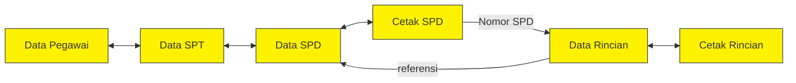

# Pengembangan Sistem SPJ BPHL 4 Jambi

## 1. Analisis Fitur dan Alur Kerja

Berdasarkan sistem yang sudah ada melalui Excel, fitur yang tersedia adalah:

- Data Pegawai
- Data SPT
- Data SPD
- Data Rincian
- Cetak SPD
- Cetak Rincian
- Laporan
- Simpan
- Keluar

## 2. Aktor yang Bekerja

- Kepala Balai
- Kepala TU
- Kepala
- Kepala
- Verifikator
- Admin
- User

## 3. Menu

- Data Pegawai
- Data SPT
- Data SPD
- Data Rincian
- Cetak SPD
- Cetak Rincian
- Manajemen Pengguna
- Manajemen Dokumen

## 4. Pages

- Landing Page
- Login
- Dashboard (Monitoring status)
- Form SPT
- Form SPD
- Form Rincian
- Kelola Dokumen
- Kelola User

## 5. Keluaran Dokumen

- Dokumen paperless SPT, SPD, dan Rincian

## 6. Aksi User per Role

| Role | Aksi |
|---|---|
| Kepala Balai, Kepala TU, Kepala, Kepala | Memeriksa dokumen selesai, tidak selesai, dan dalam progres |
| Verifikator | Memverifikasi dan menyetujui laporan dokumen |
| Admin | Mengelola sistem dan seluruh data pada sistem |
| User | Mengisi form SPT, SPD, dan Rincian. Menyerahkan SPT, SPD, dan Rincian kepada verifikator |

## 7. Konten Page

### a. Landing Page *(done)*
1. Tombol login
2. Navbar
3. Detail total pegawai
4. Profil BPHL (linking)
5. Footer

### b. Login *(done)*
1. Form input: email, password

### c. Dashboard (Monitoring Status)
1. Total pegawai
2. Total SPT
3. Total SPD
4. Dokumen selesai
5. Verifikasi: Menunggu, Disetujui, Direvisi, dan Ditolak

### d. Form SPT
1. Ikuti format Excel
2. Scan by PDF
3. Perlu pegawai ditugaskan, ditambahkan secara dinamis
4. Durasi penugasan

### e. Form SPD
1. Ikuti format Excel
2. Scan by PDF
3. Perlu pejabat, ditambahkan secara dinamis

### f. Form Rincian
1. Ikuti format Excel
2. Scan by PDF
3. Tambah detail transportasi secara dinamis

### g. Kelola Dokumen
1. CRUD Dokumen
2. Verifikasi Dokumen
3. Monitoring Dokumen: Draft, Diajukan, Diverifikasi, Ditolak

### h. Kelola User
1. CRUD User: mencari berdasarkan Nama, NIP, dan Unit Kerja
2. Individual User: Logout, Lupa password (mengajukan ke Admin)

## 8. Tech Stack

- **Backend/Framework:** Laravel
- **Database:** PostgreSQL

## 9. ERD & Relasi Antar Data

Alur data mengikuti proses pembuatan dokumen perjalanan dinas secara berurutan: mulai dari **Data Pegawai** → **Data SPT** → **Data SPD** → **Cetak SPD**, kemudian bercabang ke **Data Rincian** → **Cetak Rincian**. Setiap entitas mewarisi (carry-over) sebagian besar field dari entitas sebelumnya, lalu menambahkan field spesifiknya sendiri.

### Diagram Alur Relasi

> Catatan: Panah pada diagram asli menunjukkan hubungan dua arah (data yang sama dipakai ulang/di-*sync*) antar **Data Pegawai ↔ Data SPT**, **Data SPT ↔ Data SPD** (via field NIP Pegawai), **Data SPD ↔ Cetak SPD**, **Cetak SPD → Data Rincian** (mengalirkan Nomor SPD), dan **Data Rincian ↔ Cetak Rincian**. Ada pula panah balik dari area Cetak SPD menuju Data SPD, menandakan proses cetak dapat merujuk kembali ke data SPD asal.

### 9.1 Data Pegawai (Master)

| Field |
|---|
| Nomor ID |
| Nama Pegawai |
| NIP |
| Pangkat/Golongan |
| Jabatan |
| Sub/Seksi |

### 9.2 Data SPT
*(Relasi: Nomor ID & data pegawai mengalir dari Data Pegawai)*

| Field |
|---|
| Nomor ID |
| Nomor SPT |
| Tgl SPT |
| Pegawai yang ditugaskan |
| NIP Pegawai |
| Pangkat Pegawai |
| Jabatan Pegawai |
| Tujuan Kegiatan |
| Tempat Tujuan |
| Tgl. Berangkat |
| Tgl. Kembali |
| Lama Kegiatan |
| Kode MAK |

### 9.3 Data SPD
*(Relasi: NIP Pegawai menjadi kunci penghubung ke Data SPT)*

| Field |
|---|
| Nomor ID |
| Nomor SPD |
| Tgl SPD |
| Pegawai yang ditugaskan |
| **NIP Pegawai** *(field kunci relasi ke Data SPT)* |
| Pangkat Pegawai |
| Jabatan Pegawai |
| Tujuan Kegiatan |
| Tempat Tujuan |
| Tgl. Berangkat |
| Tgl. Kembali |
| Lama Kegiatan |
| Kode MAK |
| Jenis Perjalanan |
| Berangkat dari |
| Alat Angkut |
| PPK |
| Nama PPK |
| NIP PPK |

### 9.4 Cetak SPD
*(Relasi dua arah dengan Data SPD — merupakan tampilan cetak dari data yang sama)*

| Field |
|---|
| Nomor ID |
| Nomor SPD |
| Tgl SPD |
| Pegawai yang ditugaskan |
| NIP Pegawai |
| Pangkat Pegawai |
| Jabatan Pegawai |
| Tujuan Kegiatan |
| Berangkat dari |
| Tempat Tujuan |
| Tgl. Berangkat |
| Tgl. Kembali |
| Lama Kegiatan |
| Alat Angkut |
| Kode MAK |
| PPK |
| Nama PPK |
| NIP PPK |

### 9.5 Data Rincian
*(Relasi: Nomor SPD mengalir dari Cetak SPD/Data SPD)*

| Field |
|---|
| Nomor ID |
| **Nomor SPD** *(field kunci relasi ke Data SPD/Cetak SPD)* |
| Tgl SPD |
| Pegawai yang ditugaskan |
| NIP Pegawai |
| Tujuan Kegiatan |
| Berangkat dari |
| Tempat Tujuan |
| Lama Kegiatan |
| Jenis Perjalanan |
| Alat Angkut |
| Kode MAK |
| PPK |
| Nama PPK |
| NIP PPK |
| Biaya Transpor |
| Penginapan (%) |
| Hotel Ril |

### 9.6 Cetak Rincian
*(Relasi dua arah dengan Data Rincian — merupakan tampilan cetak dari data yang sama)*

| Field |
|---|
| Nomor ID |
| Nomor SPD |
| Tgl SPD |
| Pegawai yang ditugaskan |
| NIP Pegawai |
| Tujuan Kegiatan |
| Berangkat dari |
| Tempat Tujuan |
| Lama Kegiatan |
| Jenis Perjalanan |
| Alat Angkut |
| Kode MAK |
| PPK |
| Nama PPK |
| NIP PPK |
| Biaya Transpor |
| Penginapan (%) |
| Hotel Ril |

## 10. Ringkasan Alur Proses (End-to-End)

1. **Admin/User** menginput **Data Pegawai** sebagai master data (Nomor ID, Nama, NIP, Pangkat/Golongan, Jabatan, Sub/Seksi).
2. **User** membuat **SPT** dengan menarik data pegawai yang ditugaskan (Nomor ID, NIP) lalu melengkapi detail penugasan (tujuan, tempat, tanggal berangkat/kembali, lama kegiatan, Kode MAK).
3. Berdasarkan SPT, **User** membuat **SPD** — data pegawai & penugasan disalin dari SPT, ditambah data spesifik SPD: Jenis Perjalanan, Alat Angkut, dan data **PPK** (Pejabat Pembuat Komitmen).
4. **SPD** kemudian dicetak melalui halaman **Cetak SPD**, menghasilkan dokumen fisik/PDF resmi.
5. Dari **Nomor SPD** yang sudah dicetak, **User** melanjutkan ke **Data Rincian** untuk mencatat rincian biaya perjalanan (Biaya Transpor, Penginapan %, Hotel Riil).
6. **Data Rincian** dicetak melalui halaman **Cetak Rincian** sebagai lampiran pertanggungjawaban (SPJ) atas SPD terkait.
7. Sepanjang proses, **Verifikator** memeriksa dan menyetujui dokumen (status: Menunggu, Disetujui, Direvisi, Ditolak), sementara **Kepala Balai/Kepala TU/Kepala** memantau status dokumen (selesai, belum selesai, dalam progres) melalui Dashboard.
8. **Admin** mengelola keseluruhan data dan pengguna sistem melalui menu Kelola Dokumen dan Kelola User.
